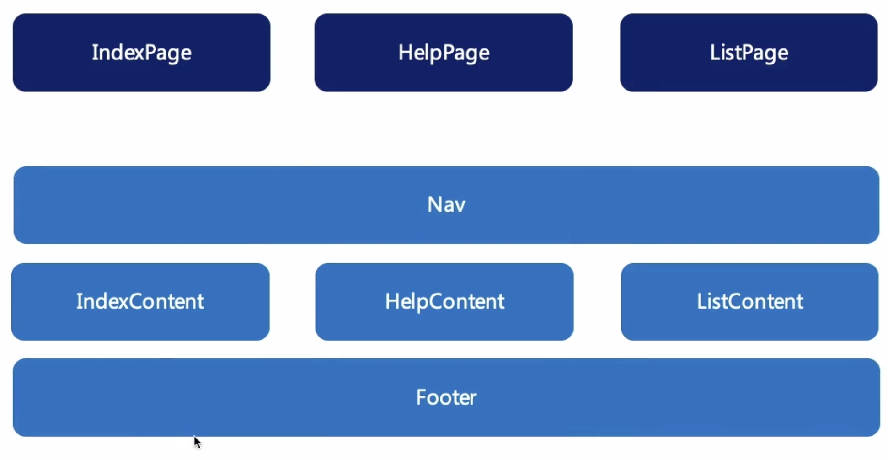
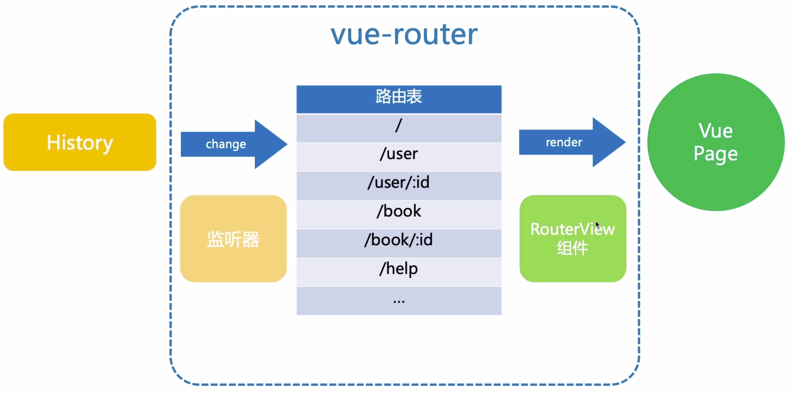

# VUE 2.0
## 一、基础用法

### 1.vue cli

1.1 安装vue脚手架


1.2 查看vue脚手架版本

vue -V

1.3查看vue版本

npm list vue

### 2.单文件组件


### 3.命名规则

3.1 产生实例的都用大驼峰命名(PascalCase)，因为我们的js类和组件都可以产生多个实例

3.2 kebab-case 烤肉串命名方式，在HTML当中是大小写不敏感的，正是因为这样，我们在模板当中约定采用烤肉串的方式命名

3.3 有人会问组件名称为大驼峰，变量名为小驼峰，怎么在模版当中可以通过烤肉串的方式使用呢，那是因为在vue当中会存在值的映射，将大小驼峰映射成烤肉串形式，我们在模板当中写的标签最终会被编译成PascalCase的js类

### 4.模板

#### 4.1模板语法

> vue.js 使用了基于html的模板语法，所有vue.js的模板都是合法的html，所以能被遵循规范的浏览器和html解析器解析

#### 4.2 模板插值

> 

#### 4.3 指令

> 指令是带有v-前缀的特殊特性
>
> 指令的职责：当表达式的值发生改变时将其产生的原带影响,响应式的作用到该dom节点上
>
> v-on 事件绑定，可简写成艾特符号@
>
> v-bind 属性绑定，可简写成冒号:

#### 4.4 条件渲染

> v-if会根据响应式的参数，在切换过程中条件块的事件监听和子组件会被虚拟dom销毁和重建
>
> 

#### 4.5  列表循环

> 不推荐在同一元素上使用v-if和v-for
>
> 非得用的话，记住v-for的优先级高于v-if
>
> 

#### 4.6 ref

> ref访问子组件或者dom节点（获取dom节点的this）
>
> 通过ref可以拿到子组件或者dom节点的方法和属性
>
> ⚠️：只有在组件或者dom节点被渲染出来以后，才能通过this.$refs去访问
>
> 

#### 4.7 JSX

> 首先我们得抛弃我们template，然后声明rander()函数
>
> JSX-条件渲染
>
> 
>
> JSX-列表循环
>
> 

### 5.数据

#### 5.1 data & prop

> ）data为什么是个函数而不是对象？
>
> 起因：js对象都是通过引用地址关联的，通过直接引用赋值的另一个变量在其修改值时会影响这个引用地址内的数据变化。即修改1处影响多处的可能。
>
> 那么如何杜绝这种影响？
>
> 结果：返回一个生产data的函数，这个组件产生的每一个实例才能维持一份被返回对象的独立拷贝，即函数作用域私有性质
>
> 
>
> ）prop 父传递子
>
> 
>
> 
>
> ）prop属性校验
>
> 

#### 5.2 单向数据流

> 
>
> vue是单向数据流的，父组件的数据更新会向下流到子组件，为什么反过来this.parentName则不行？
>
> 原因：在js中数组和对象都是通过引用传递的，对于一个对象或者数组的prop来说，去改变这个prop对象或者数组本身将会影响到父子组件状态，当子组件层级过多或子组件被引用多个地方的话，我们难以知道数据具体是在哪里修改了，会导致应用数据难以理解。
>
> 结果：所以不能这样做是防止子组件意外的去改变父组件的状态。

#### 5.3 计算属性 & 侦听器

> 计算属性和方法的区别


1.方法是在每一次页面渲染的时候，都发生一次运行。比如将count()方法放入到页面当中，当页面渲染时count()方法都会执行一次，而如果将count()放入到computed计算属性当中，当页面发生其它渲染时就不会执行。只有当count依赖的属性发生改变时，才会计算并依赖响应式进行缓存起来。

2.所以相对来说，放在computed里面性能要比方法好。

3.⚠️ 小技巧：在模板中，如果有一些常量不希望被放在dota当中去响应式依赖收集时，可以利用computed的缓存特性，将这个常量放在计算属性当中。


> 侦听器 watch

computed和watch都可以侦听数据的变化，那么他们有什么区别？

1.计算属性是依赖其内部属性相关的响应式依赖发生改变才会重新求值。当数据量较大时（依赖收集），那计算消耗的时间和内存较大，会阻塞我们的渲染。

2.watch一般用在数据变化后执行异步操作或者开销较大的操作

#### 5.4 vue中数组操作

> 这里就不得不提到Object.defineProperty的弊端

- 不能检测对象属性的添加或删除
- 不能检测到数组长度变化（通过改变length而增加的长度不能监测到）
- 其实不是因为defindProperty的局限性，而是vue出于性能的考量，不会对数组每个元素都监听

> Vue为要这么设计呢？

因为数组一般都是用来遍历一些列表的，如果列表是一个海量的数据，在vue的响应式过程中会进行前置的observe依赖收集，那这个收集就会变得很庞大间接的消耗性能

> 解决方案

解决方案一：通过vue.set在data上响应式的添加属性，并把这个属性加到响应式的跟踪里面去。


解决方案二：使用数组的push

思考：那为什么数组的push又可以用呢？

那是因为vue对于数组的方法进行了代理包装，把这些数组的函数方法也加入了响应式依赖

```js
const oldArrayProperty = Array.prototype;
const newArrayProperty = Object.create(oldArrayProperty);
['pop', 'push', 'shift', 'unshift', 'splice'].forEach((method) => {
    newArrayProperty[method] = function() {
        renderView();
        oldArrayProperty[method].call(this, ...arguments);
    };
});
 // 在observer函数中加入数组的判断，如果传入的是数组，则改变数组的原型对象为我们修改过后的原型。
    if (Array.isArray(target)) {
        target.__proto__ = newArrayProperty;
    }
```

### 6.事件&样式

#### 6.1 DOM事件

访问当前dom事件对象，可以在方法中传入$event这样的参数，通过这样的事件对象我们可以阻止事件冒泡行为。

```js
// html
<button v-on:click="add($event,1)">add</button>
// js
add(event,num) {
event.stopProation()
}
```

为了保证methods方法只有纯粹的数据逻辑，不去处理DOM相关的操作，所以vue给我们提供了事件修饰符。例如：v-on:click.stop()

#### 6.2 自定义事件(谈及到了数据双向绑定)

1. v-on除了可以监听原生事件，还可以监听组件的自定义事件，我们都知道vue组件是单向数据流的，子组件不能直接修改父组件传下来的属性。

2. 但我们可以通过内嵌的$emit方法在子组件中触发一个事件，第一个参数为事件名并同时在父组件中通过v-on监听这个事件，获取子组件传递过来的信息。

3. 这一过程其实就实现了一定的**数据双向绑定**，如下左图所示(右图:msg.sync为简写)：

   1. 父组件将data中msg的参数绑定到子组件的msg属性上，并传递给子组件
   2. 子组件通过prop接受，并将值响应式的展示在其msg属性所在dom节点上
   3. 如果子组件“修改”父组件msg参数，那么通过$emit找到在父组件中绑定的自定义事件，并传递一个参数过去用$event接受
   4. $event将参数交给msg并告知父组件msg更新，更新后父组件又通过v-on这样的属性绑定传递给了子组件。
   5. 总结就是：子组件通知父组件修改，父组件再同步下来给子组件。（数据双向绑定，其实还是数据单向流。我简称为双向绑定的单向流）


<p float="">
  
  
</p>

注意：在原生事件中，$event是事件对象。在自定义事件中，$event是传递过来的参数。

#### 6.3 样式

1.当在切换html结构样式时，我们可以通过修改当前dom节点style的值或者修改css中的class来批量修改样式。

2.在vue.js当中我们习惯用vm数据去驱动view的样式，和prop传值一样通过v-bind去处理，不同的是当v-bind绑定class和style时，vue做了一定的增强，使其不仅可以处理表达式，还能处理对象或者数组。

3.在javascript中，false、0、""、null、undefined、NaN都不是真值（true），其它都是truthy值


#### 6.4 Scoped

通过BEM来处理样式污染的问题

当使用了scoped以后，编译出来的html节点上就会多出data-v-随机哈希值，同样在编译出来的style上也会有data-v-随机哈希值的选择器


### 7.组件

#### 组件了解的目标

> 组件注册规则（如何正确使用组件）
>
> 组件生命周期（在组件生命周期的各个节点上组件都会做些什么）
>
> 动态组件

####  7.1 组件注册规则

##### 7.1.1 全局注册的组件在哪里都能使用

但有个弊端：我们工程打包过程当中会将所有组件打包进去，如果后续有组件被遗弃会造成体积不可控

##### 7.1.2 局部注册的组件只能在当前组件中使用


##### 7.1.3 全局导入

当我们经常使用组件而要不断导入时，其实很浪费时间。这时可以使用全局导入，但是还是会有体积不可控的问题产生


##### 7.1.4 按需载入（瘦身）

为了解决项目体积不可控的问题，特别是引用一些三方库的时候，比如elementUI。在最终发布的时候，我们并不希望打包所有组件资源，这个时候我就要按需载入了。也就是模板中用到了哪个组件资源库具体的组件，才会打包那个用到的组件，并不会大包所有组件资源库。


#### 7.2 组件生命周期

##### 7.2.1 组件生命周期图


##### 7.2.2 组件生命周期每个阶段所处理的事情


#### 7.3 动态组件

当页面情况较为复杂，同一个结构展示不同参数，比如要切换展示两个不同的参数的时候，基本做法就是通过不同的判断同时写多个组件来依赖一个值变化而变化，但是这样的方案就很复杂了。这时我们可以用computed属性来做。依赖值的变化去缓存而改变。就是说计算属性不仅仅只是字面上的计算这一件事情，比如通过条件判断而返回不同参数。也就是说计算属性的本质就是响应式依赖，这个依赖就是变化的依赖。

当组件变多需要切换组件的时候，用**动态组件**来做。通过 Vue 的 `<component>` 元素加一个特殊的 `is` attribute 来实现。那么利用上一步的思想引入使用vue的component标签，结合计算属性即可展示不同的组件。

#### 7.4 keep-alive

当组件切换后Dom节点会重新创建（重排重绘），这样会导致组件内数据被重新初始化，这个时候用keep-alive来缓存所包裹组件的实例，当组件再次出现在页面当中时，就不需要重新创建这个组件实例。keep-alive先前缓存下来的实例通过vm.$el获得先前的dom元素直接插入到页面中去，从而提升页面效率。

总结：

1.keep-alive获取组件实例

2.组件实例通过vm.$el获取dom元素


#### 7.5 keep-alive的生命周期和props


## 二、高阶用法
### 1.自定义指令
自己看文档去吧
### 2.双向绑定（表单）

2.1**v-model**，用于在表单元素input 、textarea及select上创建双向数据绑定的语法糖


2.2由于表单值属性不一样，那么双向绑定的也不一样，使用value和checked属性作为prop属性来传递，用change和input事件作为监听从子传到父。**v-model.lazy**用change事件代替input事件，意思就是失焦后改变


2.3 在vue框架中，v-model对于合成事件做了优化，比如输入拼音去合成中文和日文时，输入框中的拼音不被双向绑定，等到具体合成中文和日文时才双向绑定上去。


2.4 v-model的修饰符

`<input type="text" v-model.lazy="text">` 将input事件替换为change事件

`<textarea v-model.trim="text">` 去掉文字空格

`<input type="number" v-model.number="num">`  input上有个特殊的就是number。当默认值是number，通过修改默认值以后，因为input的原因值会变成string类型。这时我们家上v-model.number即可

更多具体实例在https://course.study.163.com/480000006849438/lecture-480000037171645


### 3.组件设计

我们会抽取稳定的组件nav和footer组合成layout，将具有差异化的依照组件设计思想的依赖注入原则，在使用过程中动态的分配内容




3.1插槽 v-slot设计思想，将公共的地方抽离出来


3.2 编译作用域（作用域插槽）

父组件中的变量跟子组件中的没有关系，对于子组件是不可见的。也就是说如下content的信息是在父组件编译，对于slot-layout是不可见的。


3.3 稳定的组件

- 一般稳定的（nav）组件不适合写入过多的条件判断
- 稳定的组件被多个地方引用
- 稳定的组件不要轻易去修改

当修改稳定的组件时，需要大量的测试回归去确保他的稳定性。那我们有解决的办法吗？

当然是有的，可以把在稳定子组件里的变量提升到父组件中去，这样我们就能在父组件中控制而不需要修改稳定的组件（将信息插入到子组件），但是这样子组件中的数据就没有独立和完整性，在slot中通过v-bind:绑定属性以prop作用传递给父组件slot，然后在父组件使用


### 4.组件通信

组件通信是单向数据流，在通信过程中我们可以用v-bind结合props和v-on结合$emit来相互传递参数。但是当组件层级过多，内层访问外层组件时（$emit方法），如果有一个环节传递错误就会导致故障率的产生，所以也不是那么的方便开发和debugger。

4.1 **this.$root**获取根组件实例，**this.$parent** 获取父组件实例


4.2 **$parent**的实际作用在element中定向消息的应用，找到指定要抵达的组件去传递数据


4.3 **$ref** 父组件访问子组件


4.4 ⚠️ 在this.$parent中，具有一定的强耦合出现。

​	比如说在新开发的功能中需要引用到写好的稳定组件，也就是说当子组件被多个父组件引用时，在子组件中有一段代码this.$parent.fish()，但是不是所有引用子组件的父组件中都有fish这个方法，这个时候就会报错访问不到fish这个方法。


那么如何解决这样的强耦合呢？通过依赖注入来解决一定的强耦合。但是任然还是有一定的强耦合存在，还是需要成对的出现（父子组件）因为你子组件inject的内容需要父组件provide。依赖注入的优点父子组件之间不需要关注彼此的提供来源和注入来源。缺点是组件之间的耦合还是较为紧密，不易于重构，提供的属性也是非响应式的


4.5  子组件上的某个元素上v-bind="$attrs"，v-on="$listeners"来接受父组件传递过来的参数（属性和事件），绑定属性和事件的接收可以来实现双向的绑定组件之间的通信


### 5.Vue.mixin（混入对象）

全局混入的目的：函数复用，也是JavaScript设计模式。也涉及到了原型链的思想，子类中有的就不会向上去查找。

这里需要了解vue文档里面的mixin原理和规则


### 6.Vue.use（插件使用）

也是结合了mixin，这里举例Vue.use(vuex)


### 7.组件复用

`复用方式：Mixin(对象混入)、HOC(高阶组件)、Renderless组件`

7.1 首先组件复用其中一部分也是复用的逻辑，那么逻辑的复用也就意味着可以混入对象（mixin），把公共的逻辑部分抽离成对象混入进去。

但是也有缺点：

- 打破了原有组件的封装
- 增加组件复杂度
- 可能会出现命名冲突的问题
- 仅仅只是对逻辑的复用，模板不能复用


7.2 HOC组件

高阶组件本质也是对高阶函数的引用（装饰者模式）


那么相比Mixin而言，HOC的优缺点

优点

- 模板可复用
- 不会出现命名冲突（本质上是一个HOC是套了一层父组件）

缺点

- 组件复杂度高，多层嵌套，调试很痛苦（官方也不推荐这么做）


7.3 Renderless组件

优点：

- 模板可复用
- 不会出现命名冲突
- 符合依赖倒置原则
- 复用的接口来源清晰（利用子组件的绑定属性将方法暴露给父组件去处理）

```js
// SValidate组件
<template>
  <div>
    <slot :validate="validate"></slot>
    {{ errMsg }}
  </div>
</template>
<script>
export default {
  props: ["value", "rules"],
  data() {
    return { errMsg: "" };
  },
  methods: {
    validate() {
      let validate = this.rules.reduce((pre, cur) => {
        let check = cur && cur.test && cur.test(this.value);
        this.errMsg = check ? "" : cur.message;
        return pre && check;
      }, true);
      return validate;
    }
  }
};
</script>
```

```js
// Sbody组件
<template>
  <div>
    <s-validate #default="{ validate }" :value="value" :rules="rules">
      <input type="text" @blur="validate" v-model="value" />
    </s-validate>

    <s-validate #default="{ validate }" :value="text" :rules="textRules">
      <textarea type="text" @blur="validate" v-model="text" />
    </s-validate>
  </div>
</template>

<script>
import SValidate from "./SValidate";

export default {
  data: () => ({
    value: "hi",
    text: "hi",
    rules: [
      {
        test: function(value) {
          return /\d+/.test(value);
        },
        message: "请输入一个数字"
      }
    ],
    textRules: [
      {
        test: function(value) {
          return value;
        },
        message: "请输入一个非空的值"
      }
    ]
  }),
  components: {
    SValidate
  }
};
</script>
```

自我对组件复用的总结

- 好的组件复用要达到逻辑和模板都能复用
- 所谓复用也是利用JavaScript设计理念去实现，比如函数的单例、装饰者模式，达到对其他对象的组合、沿用。
- Mixin对公共逻辑的复用，不能复用模板
- HOC是将不同的组件放入HOC组件中去经历规则以后在外层组装一个新的组件，很复杂
- Renderless组件，是将复用的组件和逻辑提供给外层组件使用。复用的可将逻辑部分暴露提供给其他外层组件（父组件），外层组件可调用复用组件暴露出来的方法以及模板
- 如果只是逻辑的复用，可尝试Mixin模式。如果是逻辑加模板都复用可尝试Renderless。
- 复用要达到动态的效果，而动态的部分尽量不要放在公共的组件部分，而是在外层组件（比如父组件）推动。

## 三、深入VUE源码分析

### 1.Object.defineProperty Vue响应式源码分析


关于响应式源码分析在知乎上写过一些，具体可点击：https://zhuanlan.zhihu.com/p/434798426


### 2. computed、watch 、watchEffect源码分析

> 书写形式
>
> ```js
> let count = 0; // count 具有响应式属性，且有value属性
> 
> // 1.computed
> let x = computed (() = > count.value + 3)
> 
> // 2.watch
> watch(() = > count.value,(currentValue,preValue) = > {},{deep,immediate})
> 
> // 3.watchEffect
> let stop = watchEffect(() = > count.value + 3)
> 
> ```
>
> 特点区别
>
> 

#### 2.1 computed

1.**会基于内部响应式依赖进行缓存**，dirty标记。computed里面的响应式变量发生修改，第一次在computed判断dirty为true时，执行fn() 即执行相加产生新值computedValue，并将dirty置为false。如果第二次直接访问触发get（无修改），dirty为false，那么直接返回value。那么dirty在什么时候置换回来true呢？在响应式依赖发生改变时（通知依赖处理阶段），置换回来。


2.**相关响应式依赖发生改变才会重新求值**，因为上一步的dirty置换成了false，所以只能缓存第一次的计算值，当相关依赖再次发生改变时，并不会进行计算。所以在computed中写入一个scheduler来控制dirty，当dirty为true时就不用置换为false，直接缓存第一次计算值。当响应依赖发生改变，get()监听到值的变化会执行判断触发renner()，renner()会把computed的计算和钩子scheduler（处理dirty是否需要置换true，是否需要再次计算）传递给effect。

在effect中执行计算体，当值改变会触发依赖的执行，在依赖的执行过程中触发钩子scheduler来打开dirty再次计算


#### 2.2 watch

watch除了能监听键值、数组多个值，还能监听函数。


source：要处理的来源，键值、数组、函数

cb：处理方式

比较前后值的不同进行处理

#### 2.3 总结

computed 与watch的区别

形式上：

computed 有个开关一样的东西来控制缓存和内部响应式数据更新（通知依赖处理）

watch 比较前后值的不同进行处理

书写上：

自己看吧

最后：

对于watch和computed的源码，这个地方很需要时间去看，我没时间，懒得看了。

## 四、VUE生态以及源码分析

### 1.Vuex上

#### 1.1官方vuex图解


state：**vuex中唯一的数据源**，vuex中的state和vue实例中的date遵循相同的规则，都具有相响应式。正是因为这样，Vue Component（vue实例）能通过computed属性返回在vuex中读取的值，从而响应式的根据state的变化进行相关渲染。

getter：**vuex允许定义getter，可以理解为store中的计算属性**。比如要定义状态或者过滤state中的数据。跟vue实例中的computed一样，依赖响应式进行缓存或者依赖响应式值变化以后通知开启并进行计算（执行函数体或者代码）

Mutation：**修改vuex Store唯一状态的唯一方法就是提交Mutation**，vuex中的mutation很类似于事件，每个mutation都有一个字符串事件类型和回调函数，通过store.commit来修改state里面的数据。特别注意的是mutation是同步的，可通过vue提供的插件机制来订阅mutation变化，可进行打点和数据监听。

Action：**来进行异步操作**，完成接口获取等异步操作

注意：

1. store中的getters和vue Component中的computed一样，但是里面书写简化的方式不一样。因为他们调用方式也不一样，有名无名函数的区别。

2. mutations中关于方法payload传参的定义，在没有定义payload的类型情况下，可能导致在actions中调用commit触发mutations里面方法传参NaN。

3. ```js
   // 在state => state.count中，不要书写{state.count},会导致参数无法显示
   ...mapState({
         count: state =>  state.count ,
         counts: state =>  state.count ,
       }),
   ```


```js
// 详细代码在note/04vuex
// store/index.js
import Vue from "vue";
import Vuex from "vuex";

Vue.use(Vuex);

export default new Vuex.Store({
  state: {
    count: 0,
  },
  getters: {
    doubleCount: (state) => state.count * 2,
  },
  mutations: {
    addCount: (state,payload=1) => (state.count += payload),
  },
  actions: {
    // asyncAddCount里面的参数相当于vuex实例对象，然后通过解构拿到commit
    asyncAddCount({commit}) {
      setTimeout(()=>{
        commit("addCount");
      }, 1500)
    }
  },
  // 模块
  modules: {},
});

```


#### 1.2本地vuex图解


```js
export default new Vuex.Store({
  state: {
    // 定义一个用户信息
    userInfo: ''
  },
  mutations: {
    // 定义一个方法用来给 userInfo 赋值
    setUserInfo (state, payload) {
      state.userInfo = payload
    }
  },
  actions: {
    // 定义一个方法：用来得到新的用户信息，并且将信息提交到 mutations
    async setUserInfo (context) {
      // 发送网络请求得到最新的数据
      const res = await apiGetInfo()
      // 将头像地址进行拼接
      res.data.avatar = 'http://127.0.0.1:1337' + res.data.avatar
      // 将新的数据保存到 mutaions 中
      context.commit('setUserInfo', res.data)
    }
  },
  modules: {
  }
  
  // 将参数保存到vuex中
  // 页面中调用：this.$store.commit('setUserInfo', parameter)
  // 文件中调用：store.commit('setUserInfo', parameter) （这里需要导入封装好的vuex）
  
  // 异步调用
  // this.$store.dispatch('setUserInfo')

```


#### 1.3 总结vuex

- **vuex最大的杀器：大大简化了组件之间通信的过程**
- 事件操作在子组件（mutations、actions），显示逻辑在父组件（state、getters），就算组件层级再深也同样适用
- 

### 2.Vuex下

#### 2.1响应式原理

```js
// 响应式部分
// 详细代码在05vuex响应式

import { Store } from "./vuex";

let store = new Store({
  state: {
    count: 0
  },
  mutations: {
    addCount(state, payload) {
      state.count += payload || 1;
    }
  },
  // 插件
  plugins: [
    store =>
    	// store的subscribe方法添加订阅mutations
      store.subscribe((mutation, state) => {
        console.log(mutation);
      })
  ]
});

document.getElementById("add").addEventListener("click", function() {
  // data.count++;
  store.commit("addCount", 1);
});
let str;
watch(() => {
  str = `hello ${store.state.count}`;
  document.getElementById("app").innerText = str;
});

```

```js
// store部分
import { reacitve } from "./index";  // 引用上面的文件

 /* 
  @param options 扩展对象
  @param reacitve 引入进来的具有响应式能力的
  */
export class Store {
  constructor(options = {}) {
    let { state, mutations, plugins } = options;
    this._vm = reacitve(state);
    this._mutations = mutations;
    
		// 订阅数组
    this._subscirbe = [];
    // 插件
    plugins.forEach(plugin => plugin(this));
  }

  get state() {
    return this._vm;
  }

  /* 
  @param type commit时提交的mutations中的方法
  @param payload 传递的参数
  */
  commit(type, payload) {
    const entry = this._mutations[type];
    if (!entry) {
      return;
    }
    // 执行mutations中的方法
    entry(this.state, payload);
		// 执行mutations
    this._subscirbe.forEach(sub => sub({ type, payload }, this.state));
  }

  // fn参数就是添加进来的mutations订阅部分
  subscribe(fn) {
    if (!this._subscirbe.includes(fn)) {
      this._subscirbe.push(fn);
    }
  }
}

```

#### 2.2模块化设计

当store单一状态树，应用的所有状态都在一个比较大的对象当中。当应用复杂时，store就会显得很臃肿。

为了解决这个问题，vuex允许我们将sotre分割成模块module

##### moudule分割

在创建vuex实例时，添加modules


##### 局部状态

Mutation、getters、actions中的state均为当前moduleA中的局部状态


##### 命名空间

默认情况下，模块内部的action、mutation、getter是注册在**全局命名空间**的，这样会导致不同的module之间存在命名冲突的问题

为了更高的封装性和复用性，所以，我们可以通过namespaced: true; 访问对应module的路径（moduleA、moduleB...）去访问各自的action、mutation、getter


##### 跨模块访问

根模块：modules

子模块：foo

root前缀的都能访问根模块下面的内容，不加就访问子模块下面的内容


### 3.Vue Router上

路由：就是通过互联的网络把信息从源地址传输到目的地址的活动

早之前路由是在后端控制，在单页应用随着ajax的崛起（局部刷新）逐步转向了前端来管理路由

#### 3.1 vue-router图解



监听器：监听history路由历史栈

change：路由改变

RouterView：页面出口

render：页面渲染

vue-router中的监听器用来监听浏览器history的变化，比如浏览器地址栏的地址改变，或者操作浏览器前进、后退按钮后，都会让history历史栈相应进行改变，当监听到history中改变以后通过路由表声明了的路由对应的组件，然后使用RouterView进行VuePage渲染。

#### 3.2 如何监听浏览器History记录变化


在window中有两种监听事件来监听浏览器历史记录变化，而这两个监听事件对应了两种监听模式：Hash Mode和HTML5 Mode

- Hash Mode模式onhashchange：监听URL当中的hash变化， 这里hash是指URL地址#后面的信息,当hash变化时会触发window.onhashchange事件

  

  

- HTML5 mode模式onpopstate：监听History栈当中的变化

#### 3.3 实现一个vue router

`详细的内容就去看代码吧，在06vue-router`

但我还是小结了一下，大致3个部分，路由表、 历史监听、渲染、组件部分

##### 3.3.1 router里面的类

1.路由表类，主要是构建路由与组件关联管理，里面实现将路由信息放入路由表类里面进行匹配

2.history类，监听检测路由变化，监听html5 mode或者hash mode这两种模式的变化

##### 3.3.2 router里面的初始化

在初始化之前会通过Vue.mixin混入钩子，重要的部分是判断是否有路由，没有就取当前的router并且很关键的一步是vue的隐藏方法Vue.util.defineReactive添加路由响应式（路由当前路径）

然后初始化时，拿到监听模式html5 mode或者hash mode，监听到当前路由的变化已经具有了响应式以后，通知match匹配改变

##### 3.3.3 渲染出口

在实例化router时 会有component组件参数，先这个把组件取出来判断有没有这个路由，有通过return抛出去。在什么时候会抛出去呢？在route发生改变时，因为上面整个的ruter实例已经被响应式，且这个过程都在被历史监听并匹配改变，匹配到了哪个路由表里的路径，就渲染哪个component

其次就是跳转时的push方法，比如router-link在html5 mode当中history.pushState或者history.replaceState不会出发popstate事件，所以要手动添加push方法去实现route变化之后响应并执行拿到的匹配目标路由。

##### 3.3.4 组件部分

router-view || router-link 组件

组件部分也就是上面第三点渲染出口的实现

### 4.Vue Router下(导航守卫)

#### 4.1 注册、收集全局守卫（这里举例全局，没有举例独享守卫、组件内部守卫）

```js
 // 详细代码在06vue-router
 // 注册导航守卫方法
  function registerHook(list, fn) {
  list.push(fn);
  return () => {
    const i = list.indexOf(fn);
    if (i > -1) list.splice(i, 1);
  };
}

 // 以下完成添加、收集全局守卫
  beforeEach(fn) {
    return registerHook(this.beforeHooks, fn);
  }
  beforeResolve(fn) {
    return registerHook(this.resolveHooks, fn);
  }
  afterEach(fn) {
    return registerHook(this.afterHooks, fn);
  }
  
```

#### 4.2 执行全局守卫

我们执行路由守卫其实就是在**拿到的匹配目标路由和route响应执行更新**之间发生的

```js
  // 详细代码在06vue-router
	confirmTransition(route, onComplete, onAbort) {
    if (route === this.current) {
      return;
    }

    const queue = [
      ...this.router.beforeHooks,
      route.beforeEnter,
      route.component.beforeRouteEnter.bind(route.instance),
      ...this.router.resolveHooks
    ];

    const iterator = (hook, next) => {
      hook(route, this.current, to => {
        if (to === false) {
          onAbort && onAbort(to);
        } else {
          next(to);
        }
      });
    };

    runQueue(queue, iterator, () => onComplete());
  }
```
### 5.vue生态总结

- computed watch vuex 里面都跟响应式有关系
- computed watch对响应式数据进行了进一步的处理，vuex是需要把state数据放入响应式
- 只是在执行依赖的时候，各有不同的事情要做：

  1.比如computed会缓存（通过判断开关）、会依赖数据响应式变化而计算，

  2.watch则是会监听变化去执行操作（通过比较新旧值），

  3.vuex则是把state里面的数据添加到响应式作响应式更新，后面通过mutation同步去改变状态，同样也能通过action异步去改变。最后访问还是修改再去做响应式数据的变化。mutation能订阅 观测状态变化，正是因为vue提供的插件机制能订阅，在源码分析到有写入plugins会执行订阅添加mutation，整个store类当中也有订阅的方法，从代码上看插件执行时会执行订阅，订阅的就是mutation。在commit时，不仅仅会执行调用mutation里面的方法，还会执行插件添加进来的订阅。
- vue-router暂时没有什么总结，但是在现实一个vue-router上有小结